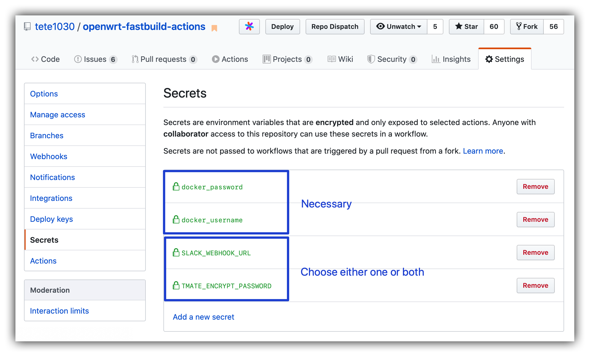
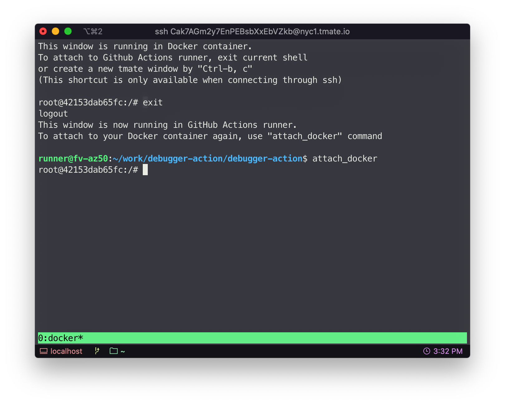

BuildWrt
============================================================================

> Original OpenWrt-FastBuild-Actions

[中文说明](README_CN_OUTDATED.md)（过时的旧版本说明，不建议阅读，欢迎PR）

This project accelerates OpenWrt building process in GitHub Actions. 

Building OpenWrt in Github Actions can be very convenient for users who want to upgrade or modify their routers frequently. Despite convenience, users have to wait for hours for even slight changes, because cache from previous buildings is not recycled.

By storing cache in docker images, BuildWrt significantly decreases compiling duration in Github Actions. You can use Docker Hub or other Docker registries as the storage.

- [Features Overview](#features-overview)
- [Usage](#usage)
  - [Setup](#setup)
    - [Secrets page](#secrets-page)
  - [Building](#building)
  - [Advanced usage](#advanced-usage)
    - [Re-create builder](#re-create-builder)
    - [Rebase your builder](#rebase-your-builder)
  - [Trigger methods](#trigger-methods)
  - [Building options](#building-options)
    - [Examples of using building options](#examples-of-using-building-options)
  - [Multiple target profiles](#multiple-target-profiles)
    - [Default profile](#default-profile)
  - [Manually adding packages](#manually-adding-packages)
- [Details](#details)
  - [Building process explained](#building-process-explained)
    - [First-time building](#first-time-building)
    - [Following buildings](#following-buildings)
  - [Squashing Strategy](#squashing-strategy)
- [Debugging and manually configuring](#debugging-and-manually-configuring)
  - [Important directories](#important-directories)
- [FAQs](#faqs)
  - [Why all targets seem triggered when only some are intended?](#why-all-targets-seem-triggered-when-only-some-are-intended)
- [Todo](#todo)
- [Acknowledgments](#acknowledgments)
- [License](#license)

## Features Overview

- Building cache recycle
- Multiple target profiles
- Flexible pre-building customization
  - Building config file (`.config`)
  - Feeds config file (`feeds.conf`)
  - Individual packages to be installed from Git repositories
  - Files to be copied to build root
  - Patches to be applied onto build root
  - Shell scripts to be executed before compiling
- Runtime customization & debug
  - Shell accessing through SSH or Web page (allow `make menuconfig`)
  - Debug checkpoint
  - Failure fallback checkpoint
- Runtime job options
  - re-create builder
  - packages only
- Abundant trigger methods
  - Push event (only changed targets are built)
  - Commands in commit messages
  - Deployment events (you can use [tete1030/github-repo-dispatcher](https://github.com/tete1030/github-repo-dispatcher))
  - Repository dispatch events (you can use [tete1030/github-repo-dispatcher](https://github.com/tete1030/github-repo-dispatcher))
  - Repo been starred by yourself
  - Scheduled cron jobs

## Usage

### Setup

1. Sign up for [GitHub Actions](https://github.com/features/actions/signup)
2. Fork this repo
3. **Register a Docker Hub account** and get your **personal access token**. Fill your username and the token into the forked repo's **Settings->Secrets** page. Use `docker_username` for your username, and `docker_password` for your token. See [Secrets page](#secrets-page) for correct settings.
4. *(Necessary when debugging or runtime configuring)* Set either `SLACK_WEBHOOK_URL`, `TMATE_ENCRYPT_PASSWORD` or both in the Secrets page. Refer to [Debugging and manually configuring](#debugging-and-manually-configuring). See [Secrets page](#secrets-page) for correct settings.
5. Add your building target
   1. Copy the `user/example` folder, rename it (refered to by `${TARGET_NAME}`) and put it in `user` folder. This is your target folder.
   2. Customize `user/${TARGET_NAME}/settings.ini`.
   3. Put your `.config` file to `user/${TARGET_NAME}/config.diff`.
   4. *(Optional)* Add into `user/${TARGET_NAME}/packages.txt` extra packages that are not in feeds.
   5. *(Optional)* Add into `user/${TARGET_NAME}/custom.sh` any shell script to be executed right before compiling.
   6. *(Optional)* Add into `user/${TARGET_NAME}/patches/` any patch to be applied onto the OpenWrt folder.
   7. *(Optional)* Add into `user/${TARGET_NAME}/files/` any file you want to be copied into the OpenWrt folder (an exception: `.config` is not copied)
6. Add your `${TARGET_NAME}` to `jobs.build.strategy.matrix.target` section in `.github/workflows/build-openwrt.yml` ( and to `jobs.squash.strategy.matrix.target` of `.github/workflows/squash.yml` if you are using squash strategy)

<!-- # TODO solve references -->

#### Secrets page



### Building

The first-time building generally takes **1.5~3 hours** depending on your config.

After the first-time building, only **15 minutes ~ 1 hour** is needed, depending on your config and how much your config has changed.

1.  Make your changes
2.  **Commit and push** your changes. This will automatically trigger a building instance for changed targets.
3.  Wait for the job to finish.
4.  Collect your files in the `Artifacts` menu of the job's log page.

Many other methods allow you to trigger a building. Refer to [Trigger methods](#trigger-methods)

### Advanced usage

#### Re-create builder

If you have largely modified your configs, e.g. changed the repo or branch of OpenWrt, building may fail because old invalid cache could interfere with compiling.

It's better to completely re-create your builder. This means no previous cache is used, and all source code will be updated (if no version specified). This behaves the same as a first-time building. You can set the `rebuild` building option to achieve this. For usage of building options, refer to [Manually trigger building and its options](#manually-trigger-building-and-its-options).

#### Rebase your builder

This is faster than re-create a builder. Technically it reuses the builder from a recent first-time building instead of last building. It allow you to shrink the size of your builder without a complete rebuild. You can enable the `rebase` option.

### Trigger methods

By default, you can trigger building by
- Push your changes. BuildWrt will detect if any file affecting a target has been changed. If so the target will be built; otherwise skipped.
- Commands in commit messages. Include `#target=${TARGET_NAME}#` in the message of the last commit in a push.
- Deployment events. Support building any commit/branch/tag. Use [tete1030/github-repo-dispatcher](https://github.com/tete1030/github-repo-dispatcher) to send the event.
  - Install [tete1030/github-repo-dispatcher](https://github.com/tete1030/github-repo-dispatcher)
  - Click "Deploy" button at the top right corner
  - Fill your Github personal access token in the "Token" prompt
  - Specify your commit/branch/tag in the "Ref" prompt (e.g. `master`)
  - Fill `build` in the "Task" prompt
  - Fill `{"target": "${TARGET_NAME}"}` in the "Payload" prompt (the content should comply with JSON format)
- Repository dispatch events. Use [tete1030/github-repo-dispatcher](https://github.com/tete1030/github-repo-dispatcher) to send the event.
  - Install [tete1030/github-repo-dispatcher](https://github.com/tete1030/github-repo-dispatcher)
  - Click "Repo Dispatch" button at the top right corner
  - Fill your Github personal access token in the "Token" prompt
  - Fill `build` in the "Type" prompt
  - Fill `{"target": "${TARGET_NAME}"}` in the "Payload" prompt (in JSON)

If enabled, triggering is also possible when
- Your repo is starred by yourself. This makes the "Star" button act as a building trigger for yourself. Enable this by adding the following into the `on` section of `.github/workflows/build-openwrt.yml`:
  ```yml
    watch:
      types: [started]
  ```
- Scheduled cron job. Enable this by adding the following into the `on` section of `.github/workflows/build-openwrt.yml`:
  ```yml
    # '0 0 * * 0' means sunday midnight
    # Examples of cron: https://crontab.guru/examples.html
    schedule:
      - cron: '0 0 * * 0'
  ```

### Building options

> Refer to [Trigger methods](#trigger-methods) for how to include options

Building options are possible when building is triggered by
- Commands in commit messages. Include `#OPTION_NAME#` in commit messages. E.g., `#target=x86_64##debug#` (merging two '#' is as well acceptable: `#target=x86_64#debug#`).
- Deployment events. Include `"OPTION_NAME": true` in the JSON Payload. E.g. `{"target": "x86_64", "debug": true}`.
- Repository dispatch events. Include `"OPTION_NAME": true` in the JSON Payload. E.g. `{"target": "x86_64", "debug": true}`

All boolean options are by default `false`. The following are options available.

- `target`(string): the build target name
- `debug`(bool): entering tmate during and after building, allowing you to SSH into the docker container and Actions. See [Debug and manually configure](#debug-and-manually-configure) for detailed usage.
- `push_when_fail`(bool): always save the builder even if the building process failed. Not recommended to use
- `rebuild`(bool): re-create the building environment completely
- `rebase`(bool): use first-time builder instead of last builder
- `update_repo`(bool): update source of main repo. It could fail if any tracked file of the repo has changed.
- `update_feeds`(bool): update source of feed packages and manually added packages. It could fail if any tracked file changed.
- `package_only`(bool): only build packages, no firmware

#### Examples of using building options

The following are examples for re-creating builder.

**Through commit message**
1. Save all the files you changed
2. At the last commit before push, commit with message:
   ```
   Some commit message #target=x86_64#rebuild#
   ```
3. Push

**Through Repo Dispatch or Deployment events**
1. Open your forked repo
2. Click "Repo Dispatch" or "Deploy" at the top right corner (require installing [tete1030/github-repo-dispatcher](https://github.com/tete1030/github-repo-dispatcher))
3. Fill `build` in "Type/Task" prompt
4. If using "Deploy" trigger, fill your branch/tag/commit in "Ref" prompt (e.g. `master`)
5. Fill `{"target": "x86_64", "rebuild": true}` in "Payload" prompt

### Multiple target profiles

You can have multiple target profiles. They are arranged in

```
user
├── default                         # Default profile settings
│   └── ...
├── target1                         # First target
│   ├── config.diff                 # From .config
│   ├── custom.sh                   # Scripts to be executed before compiling
│   ├── files                       # Files to be copied to OpenWrt buildroot dir, arranged in same structure
│   │   └── somefile
│   └── settings.ini                # Settings
└── target2
    ├── config.diff
    ├── custom.sh
    ├── packages.txt
    ├── patches                     # Patches to be applied onto OpenWrt buildroot dir
    │   └── 001-somepatch.patch
    └── settings.ini
```

Here are profiles I am using.

<details>
  <summary>Click to expand</summary>

```
user
├── default
│   ├── files
│   │   └── package
│   │       ├── kernel
│   │       │   └── linux
│   │       │       └── modules
│   │       │           └── netconsole.mk
│   │       ├── openwrt-packages
│   │       │   ├── libJudy
│   │       │   │   ├── Makefile
│   │       │   │   └── patches
│   │       │   │       ├── 100-host-compile-JudyTablesGen.patch
│   │       │   │       └── 300-makefile-nodoc-notest.patch
│   │       │   └── netconsole
│   │       │       ├── Makefile
│   │       │       └── files
│   │       │           ├── netconsole.config
│   │       │           └── netconsole.init
│   │       └── system
│   │           └── fstools
│   │               └── 0010-fstools-block-make-extroot-mount-preparation-more-robust.patch
│   └── patches
│       ├── 000-download-max-time.patch
│       ├── 002-netdata-with-dbengine.patch
│       ├── 003-netdata-init-with-TZ.patch
│       └── 006-autossh-init.patch
├── wdr4310v1
│   ├── config.diff
│   ├── custom.sh
│   ├── files
│   │   └── package
│   │       ├── firmware
│   │       │   └── wireless-regdb
│   │       │       └── patches
│   │       │           └── 601-reghack.patch
│   │       ├── kernel
│   │       │   └── mac80211
│   │       │       └── patches
│   │       │           └── ath
│   │       │               └── 499-ath9k_reghack.patch
│   │       └── network
│   │           └── services
│   │               └── hostapd
│   │                   └── patches
│   │                       └── 399-reghack.patch
│   ├── packages.txt
│   └── settings.ini
└── x86_64
    ├── config.diff
    ├── custom.sh
    ├── packages.txt
    ├── patches
    │   ├── 005-openclash-clashr.patch.disable
    │   └── 007-transmission-init.patch
    └── settings.ini
```
</details>

#### Default profile

You can provide default profile in `user/default`. The files in `user/${TARGET_NAME}` and `user/default` will be automatically merged (internally creating a folder named `user/current`). When they have conflicted files, generally file-level overriding strategy is used; files in `user/${TARGET_NAME}` will overwrite same files in `user/default`, with only one exception `settings.ini`.

For `settings.ini`, option-level instead of file-level overriding is the strategy for merging. For example, for option `REPO_BRANCH`, overriding will happen onto the same option in `user/default/settings.ini` if it is set in `user/${TARGET_NAME}/settings.ini`, but option `REPO_URL` won't be affected by this fact (the two options are independent).

### Manually adding packages

Use `user/${TARGET_NAME}/packages.txt`

```
Packages will be put into 'package/openwrt-packages' dir
Note that to have it compiled, you also have to set its CONFIG_* options
The format is:
PACKAGE_NAME PACKAGE_GIT [ref=REF] [root=ROOT] [subdir=SUBDIR] [rename=RENAME] [mkfile-dir=MKFILE_DIR] [use-latest-tag] [override]
REF is optional. You can specify branch/tag/commit
ROOT is optional. Specifying the parent path under 'package/' of this package. Defaults to 'openwrt-packages'.
SUBDIR is optional. The path of subdir within the repo can be specified
RENAME is optional. It allows renaming of PKG_NAME in Makefile of the package
MKFILE_DIR is optional. You can specify the dir of Makefile, only used when RENAME is specified.
'use-latest-tag' will retrieve latest release as the REF. It shouldn't be specified together with REF. Currently only github repo is supported.
'override' will delete packages that are already existed.

Examples:
mentohust https://github.com/KyleRicardo/MentoHUST-OpenWrt-ipk.git
luci-app-mentohust https://github.com/BoringCat/luci-app-mentohust.git ref=1db86057
syslog-ng https://github.com/openwrt/packages.git ref=master root=feeds/packages/admin subdir=admin/syslog-ng override
```

## Details

### Building process explained

> Note: `user/current/*` files are files merged from `user/${TARGET_NAME}/*` and `user/default/*`.

#### First-time building

1. `update_repo.sh`. Download OpenWrt source code.
2. `update_feeds.sh`. Install all packages from feeds and manually added ones defined in `user/current/packages.txt`.
3. `customize.sh`. Copy `user/current/.config` files, copy `user/current/files`, apply patches in `user/current/patches`, Execute `user/current/custom.sh`.
4. `download.sh`, Execute `make download`
5. `compile.sh`, Multi/single-thread compile
6. Upload current builder both as `${BUILDER_NAME}:${BUILDER_TAG}` and `${BUILDER_NAME}:${BUILDER_TAG}-inc` to docker registry.
7. Upload files to Artifacts
    - `OpenWrt_packages`: all packages
    - `OpenWrt_firmware`: firmware

#### Following buildings

1. Pull `${BUILDER_NAME}:${BUILDER_TAG}-inc` (if `rebase` is enabled, use `${BUILDER_NAME}:${BUILDER_TAG}` instead) from docker registry.
2. `update_repo.sh`. Only when `update_repo` option is set, update OpenWrt source code.
3. `update_feeds.sh`. Install missing packages in `user/current/packages.txt`. Only when `update_feeds` option is set, update all feed packages and manually added packages.
4. `customize.sh`. Copy `user/current/.config` files, copy `user/current/files`, apply patches in `user/current/patches`, Execute `user/current/custom.sh`.
5. `download.sh`, Execute `make download`
6. `compile.sh`, Multi/single-thread compile
7. Upload current builder as `${BUILDER_NAME}:${BUILDER_TAG}-inc` to docker registry (overwrite old one).
8. Upload files to Artifacts
    - `OpenWrt_packages`: all packages
    - `OpenWrt_firmware`: firmware only

### Squashing Strategy

Squashing is used for compressing your builders. When too many layers are stacked in a docker image, it usually has a large amount of duplicated and unused files wasting space. Squashing will compress all docker layers into single one to improve space efficiency. This is automatically executed when building if the number of layers exceeds a threshold. However it takes extra time to execute. You can enable periodic and manual squashing job by uncommenting trigger events in `.github/workflows/squash.yml`.

## Debugging and manually configuring

Thanks to [tmate](https://tmate.io/), you can enter into both the docker containers and GitHub Actions runners through SSH to debug and manually change your configurations, e.g. `make menuconfig`. To do it, you have to enable the building option: `debug`. See [Building Options](#building-options) for ways of using options.



For safety of your sensitive information, you **must** either set `SLACK_WEBHOOK_URL` or `TMATE_ENCRYPT_PASSWORD` in the **Secrets** page to protect the tmate connection info. Refer to [tete1030/safe-debugger-action/README.md](https://github.com/tete1030/safe-debugger-action/blob/master/README.md) for details.

Note that the configuration changes you made should only be for **temporary usage**. Even though your changes in the docker container will be saved to Docker Hub, there are situations where you manual configuration may lost:
1. The `rebuild` or `rebase` option is set
2. Some files will be overwritten during every building. For example, if you have executed `make menuconfig` in the container, the changes of the `.config` file seem saved. In fact, during next building, the `config.diff` file will be copied to overwrite the old `.config`.

To make permanent changes, it is always recommended to use the `user/${TARGET_NAME}` mechanism.

### Important directories

Here list the directories (inside docker containers) that are used internally when building

- `${OPENWRT_CUR_DIR}`: OpenWrt directory that is currently working on (equal to either `${OPENWRT_COMPILE_DIR}` or `${OPENWRT_SOURCE_DIR}`)
- `${OPENWRT_COMPILE_DIR}`: OpenWrt directory used for compiling (normally in docker container's `/home/builder/openwrt`)
- `${OPENWRT_SOURCE_DIR}`: OpenWrt directory used for creating source code tree (normally in docker container's `/tmp/builder/openwrt`)

When debugging, in most cases you should use `${OPENWRT_CUR_DIR}` as this is the dir that the builder is currently working on and where error happened.

## FAQs

### Why all targets seem triggered when only some are intended?

This is expected. We use a script instead of workflow conditions to select which jobs should be executed. This means every target would be launched to run the selection script. Targets that are not intended will quit quickly. This method allows better complexity for the selection process.

## Todo

See [TODO](TODO)

## Acknowledgments

- [P3TERX's Actions-Openwrt](https://github.com/P3TERX/Actions-OpenWrt)
- [crazy-max/ghaction-docker-buildx](https://github.com/crazy-max/ghaction-docker-buildx)
- [Docker Hub](https://hub.docker.com/)
- [Microsoft Azure](https://azure.microsoft.com)
- [GitHub Actions](https://github.com/features/actions)
- [tmate](https://github.com/tmate-io/tmate)
- [mxschmitt/action-tmate](https://github.com/mxschmitt/action-tmate)
- [csexton/debugger-action](https://github.com/csexton/debugger-action)
- [OpenWrt](https://github.com/openwrt/openwrt)
- [Lean's OpenWrt](https://github.com/coolsnowwolf/lede)

## License

Most files under

[MIT](LICENSE) © Texot

Original idea and some files under

[MIT](https://github.com/P3TERX/Actions-OpenWrt/blob/master/LICENSE) © P3TERX
