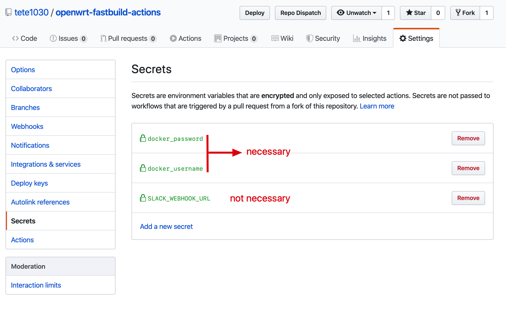

OpenWrt在线增量编译
============================================================================

> 目前主要编译流程已大幅优化，现在用起来会简单一些。
>
> 本项目最适合于经常修改编译设置，或时不时需要添加新的软件包的人群。它默认不会在每次编译时拉取最新的OpenWrt和packages的代码（除非你指定它这样做），因为这样会影响增量编译的实用性和稳定性。
> 
> 如果你并不喜欢这样，或者不在乎长时间的编译过程，或者认为以下说明比较复杂，你也可以使用[P3TERX's Actions-Openwrt](https://github.com/P3TERX/Actions-OpenWrt)或[KFERMercer's OpenWrt-CI](https://github.com/KFERMercer/OpenWrt-CI)。它们用起来非常简单，除了编译比较花费时间。

本项目灵感来自于[P3TERX's Actions-Openwrt](https://github.com/P3TERX/Actions-OpenWrt)。

Github Actions和Actions-Openwrt让我们可以很方便地自动化编译OpenWrt固件，而不必在本地编译。然而Github Actions不存储缓存，已编译过的文件也不会在下次编译重新被使用。这就意味着，即便只是很小的改动，每次编译我们要等上很久来重新编译整个固件。

本项目使用Docker Hub或任何Docker Registry存储编译状态，使得后续的编译可以增量进行。

- [OpenWrt在线增量编译](#openwrt%e5%9c%a8%e7%ba%bf%e5%a2%9e%e9%87%8f%e7%bc%96%e8%af%91)
  - [特点](#%e7%89%b9%e7%82%b9)
  - [用法](#%e7%94%a8%e6%b3%95)
    - [基础用法](#%e5%9f%ba%e7%a1%80%e7%94%a8%e6%b3%95)
      - [第一次编译](#%e7%ac%ac%e4%b8%80%e6%ac%a1%e7%bc%96%e8%af%91)
        - [Secrets页面](#secrets%e9%a1%b5%e9%9d%a2)
      - [后续编译](#%e5%90%8e%e7%bb%ad%e7%bc%96%e8%af%91)
    - [高级用法（未完成）](#%e9%ab%98%e7%ba%a7%e7%94%a8%e6%b3%95%e6%9c%aa%e5%ae%8c%e6%88%90)
  - [细节（未完成）](#%e7%bb%86%e8%8a%82%e6%9c%aa%e5%ae%8c%e6%88%90)
  - [调试和手动配置](#%e8%b0%83%e8%af%95%e5%92%8c%e6%89%8b%e5%8a%a8%e9%85%8d%e7%bd%ae)
  - [FAQs](#faqs)
    - [为什么Docker Hub的repo页面我看不到任何tag？](#%e4%b8%ba%e4%bb%80%e4%b9%88docker-hub%e7%9a%84repo%e9%a1%b5%e9%9d%a2%e6%88%91%e7%9c%8b%e4%b8%8d%e5%88%b0%e4%bb%bb%e4%bd%95tag)
    - [如何添加自定义安装包，并定制部分文件？](#%e5%a6%82%e4%bd%95%e6%b7%bb%e5%8a%a0%e8%87%aa%e5%ae%9a%e4%b9%89%e5%ae%89%e8%a3%85%e5%8c%85%e5%b9%b6%e5%ae%9a%e5%88%b6%e9%83%a8%e5%88%86%e6%96%87%e4%bb%b6)

## 特点

- 在Docker Hub或其他Registry加载和存储OpenWrt编译状态
- 支持编译选项
- 多种触发模式
  - Push触发，支持在commit message中包含指令
  - Deployment事件触发（可使用[tete1030/github-repo-dispatcher](https://github.com/tete1030/github-repo-dispatcher)）
  - Repository dispatch事件触发（可使用[tete1030/github-repo-dispatcher](https://github.com/tete1030/github-repo-dispatcher)）
  - 自己给自己Star触发（可指定Star的触发者）
  - 定时触发
- 两个编译模式（冒号前是Github Actions中的job名称）
  - `build-inc`：增量编译固件和软件包（每次push自动进行，标准配置下大约每次40分钟，第一次编译时耗时大约3小时）
  - `build-package`：增量编译软件包（每次push自动进行，标准配置下大约每次25分钟，当仅需要编译软件安装包时比较有用）
- 支持通过SSH调试和配置（e.g. `make menuconfig`）

## 用法

默认配置使用了[coolsnowwolf/lede](https://github.com/coolsnowwolf/lede)作为OpenWrt源码。如果你想要官方的Openwrt 19.07，请使用["openwrt_official"分支](https://github.com/tete1030/openwrt-fastbuild-actions/tree/openwrt_official)。（它仅仅是更改了`.github/workflows/build-openwrt.yml`中的`REPO_URL`、`REPO_BRANCH`）

如果你想查看我个人的编译配置，打开["sample"分支](https://github.com/tete1030/openwrt-fastbuild-actions/tree/sample)。

### 基础用法

#### 第一次编译

第一次编译通常花费**1.5至3小时**，取决于你的配置。

1. 注册[GitHub Actions](https://github.com/features/actions/signup)
2. Fork本项目
3. **注册Docker Hub**. 这步很重要
4. 取得Docker Hub的**personal access token**。在你自己Fork的Repo中的**Settings->Secrets**页面填写你的Docker Hub用户名和token。使用“docker_username”填写用户名，使用“docker_password”填写token。详见[Secrets页面](#secrets页面)。
5. *(可选，debug时必须)* 在Secrets页面设置`SLACK_WEBHOOK_URL`或`TMATE_ENCRYPT_PASSWORD`以保护你的敏感信息。 请参考[调试和手动配置](#调试和手动配置).
6. *(可选)* 定制`.github/workflows/build-openwrt.yml`以修改你想在Docker Hub保存的**builder名和其他选项**。
7. **生成你的`.config`文件**，并把它重命名为`config.diff`。把它放在`user`目录。
8. *(可选)* 如果你想**放置额外安装包**，定制`scripts/update_feeds.sh`。([Wiki-如何添加自定义安装包？](https://github.com/tete1030/openwrt-fastbuild-actions/wiki/%E5%A6%82%E4%BD%95%E6%B7%BB%E5%8A%A0%E8%87%AA%E5%AE%9A%E4%B9%89%E5%AE%89%E8%A3%85%E5%8C%85%EF%BC%9F))
9. *(可选)* 在`user/patches`目录放置**补丁文件**。补丁会自动在`update_feeds.sh`之后，`download.sh`之前执行。
10. **Commit并Push**。这一步骤会自动触发编译。
11. 等待`build-inc`任务完成。
12. 在`build-inc`任务的`Artifacts`目录下载编译好的文件。

##### Secrets页面

#### 后续编译

第一次编译完成后，当你更改配置时，你只需要使用以下的步骤编译你的固件和软件包。这一编译过程通常只花费**20分钟至1小时**时间，取决于你的具体配置。

1. *(可选)* 根据需要修改你的`user/config.diff`
2. *(可选)* 根据需要修改你的`scripts/update_feeds.sh`
3. *(可选)* 根据需要添加新的补丁至`user/patches`目录
4. Commit并Push。如果你想执行`build-inc`任务，你不需要进行任何特殊操作。如果你需要执行`build-package`，你可以在Push前的最后一个commit message中包含这一字符串：`#build-package#`
5. 等待`build-inc`或`build-package`完成
6. 在“Artifacts”目录收集文件

### 高级用法（未完成）

抱歉，这部分还没完成。请参考[Advanced Usage](README.md#advanced-usage)

## 细节（未完成）

请参考[Details](README.md#details)

## 调试和手动配置

通过[tmate](https://tmate.io/)，你可以通过SSH进入docker容器或Github Actions虚拟机以便你调试或更改配置，例如执行`make menuconfig`。如要进入这个模式，你需要开启构建选项`debug`。请参考[Manually trigger building and its options](README.md#manually-trigger-building-and-its-options)以了解如何使用构建选项。

为了你敏感信息的安全，你**必须**在**Secrets**页面设置`SLACK_WEBHOOK_URL`或`TMATE_ENCRYPT_PASSWORD`以保护你的tmate连接信息。参考[tete1030/safe-debugger-action/README.md](https://github.com/tete1030/safe-debugger-action/blob/master/README.md)以了解原因和它们的用法。

请注意你在docker容器内做出的手动配置应当仅仅是为了**临时使用**的。尽管你在docker容器内的更改会被保存并上传Docker Hub，仍有许多情况会导致你的这些手动配置丢失：
1. 使用了`rebuild`选项以完全重建你的base builder并rebase你的incremental builder（参考[Mechanism](README.md#mechanism)）
2. 使用了`use_base`或`use_inc`选项以rebase你的incremental builder
3. 部分文件会在每次编译时被覆盖。例如，如果你在docker 容器内使用了`make menuconfig`，`.config`文件会被修改并保存到Docker Hub。但是当下次编译时，`user/config.diff`文件会被复制到`.config`文件上并覆盖它。这将导致你上次编译时使用`make menuconfig`做出的更改丢失。

为了作出永久的配置改变，你仍应使用`user/config.diff`文件及本仓库内提供的其他自定义方法。

## FAQs

### 为什么Docker Hub的repo页面我看不到任何tag？

这些tag实际上存在，只是在网页上看不到。这是有buildx的已知bug导致：
- https://github.com/docker/hub-feedback/issues/1906
- https://github.com/docker/buildx/issues/173

### 如何添加自定义安装包，并定制部分文件？

[Wiki-如何添加自定义安装包？](https://github.com/tete1030/openwrt-fastbuild-actions/wiki/%E5%A6%82%E4%BD%95%E6%B7%BB%E5%8A%A0%E8%87%AA%E5%AE%9A%E4%B9%89%E5%AE%89%E8%A3%85%E5%8C%85%EF%BC%9F)
